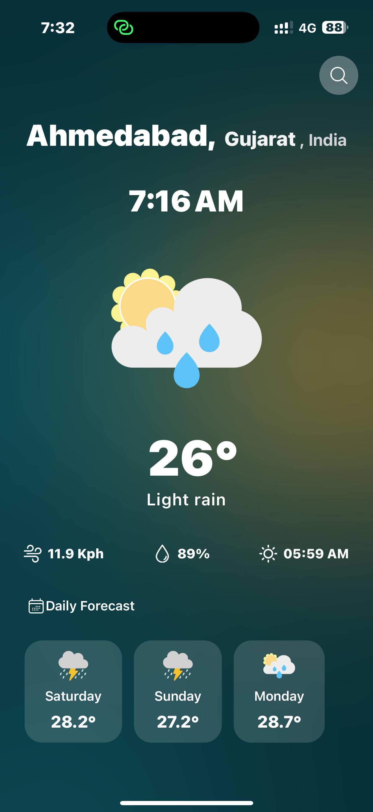
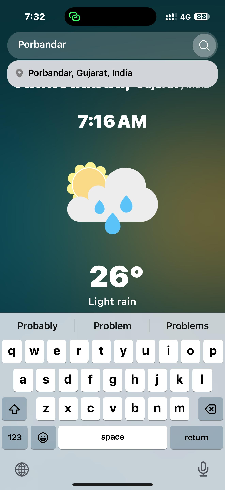

# 🌤️ Weather App

**Weather App** is a cross-platform mobile app (📱 **Android & iOS**) that provides accurate, real-time weather information using location services and search functionality. Built with **React Native** and **Expo**, the app delivers a smooth and responsive experience across all devices.

<p align="center">
  
</p>

---

## 📱 Features

- 📍 **Location-Based Weather** – Automatically fetches weather based on your device's location.
- 🌡️ **Current Conditions** – Displays wind speed, humidity, and sunrise time.
- 📆 **Daily Forecast** – Shows weather forecast for today and upcoming days.
- 🔍 **Search Any City** – Get weather details for any city worldwide.
- 💾 **Persistent Storage** – Saves the last searched city using AsyncStorage.

---

## 🧰 Tech Stack

| Category           | Technologies Used                      |
|-------------------|-----------------------------------------|
| Frontend          | React Native, Expo                      |
| API               | Weather API (OpenWeatherMap or similar) |
| Persistent Storage| AsyncStorage                            |
| UI Styling        | Responsive Design                       |
| Version Control   | Git, GitHub                             |

---

## 🖼️ App Screenshots

### 🏠 Home Screen  


### 🔍 Search Field  


### 📄 Search Results  


---

## 🚀 Getting Started

### Prerequisites

Make sure you have the following installed:

- **Node.js ≥ 16**
- **Expo CLI** – Install globally with:
  ```bash
  npm install -g expo-cli

---
##📦 Dependencies Used
- **react-native**
- **expo**
- **expo-location**
- **@react-native-async-storage/async-storage**
- **axios**
- **react-native-svg** (for icons and graphs if used)
---

## 🔧 Installation
Clone the repo
    ```bash
    git clone https://github.com/your-username/weather-app.git
    cd weather-app
    ```

Install dependencies
    ```bash
    npm install
    ```

Start the development server
    ```bash
    npx expo start
    ```
